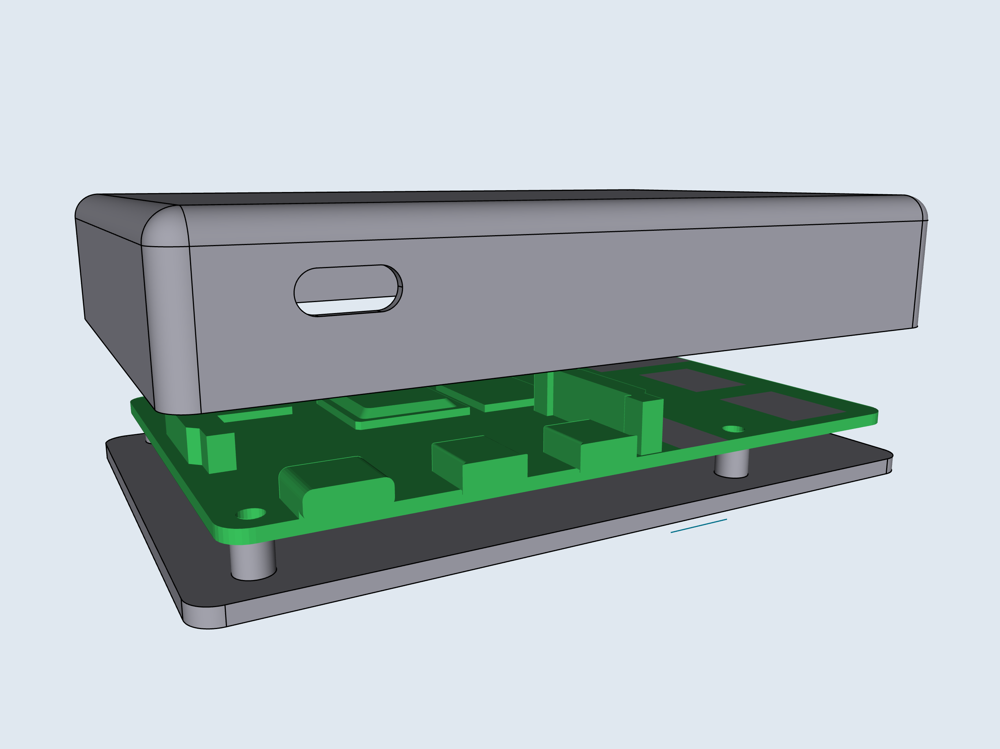

---
# multilingual page pair id, this must pair with translations of this page. (This name must be unique)
title: Project Chimera - Linux on iPad

# post specific
# if not specified, .name will be used from _data/owner/[language].yml
# multiple category is not supported
#category: 
# multiple tag entries are possible
tags: [raspberry, pi, ipad, ios, productivity]
# thumbnail image for post
img: ":project-chimera/design.png"
# disable comments on this page
#comments_disable: true

# publish date
date: 2021-09-20 17:48:00 +0000

# seo
# if not specified, date will be used.
#meta_modify_date: 2022-02-10 08:11:06 +0900
# check the meta_common_description in _data/owner/[language].yml
#meta_description: ""

# optional
# please use the "image_viewer_on" below to enable image viewer for individual pages or posts (_posts/ or [language]/_posts folders).
# image viewer can be enabled or disabled for all posts using the "image_viewer_posts: true" setting in _data/conf/main.yml.
#image_viewer_on: true
# please use the "image_lazy_loader_on" below to enable image lazy loader for individual pages or posts (_posts/ or [language]/_posts folders).
# image lazy loader can be enabled or disabled for all posts using the "image_lazy_loader_posts: true" setting in _data/conf/main.yml.
#image_lazy_loader_on: true
# exclude from on site search
#on_site_search_exclude: true
# exclude from search engines
#search_engine_exclude: true
# to disable this page, simply set published: false or delete this file
#published: false
---

# What is Chimera

This is the scientific definition:

> A Chimera \[kaɪˈmɪɹə\], is a single organism composed of cells with more than one distinct genotype.

How that should be understood in terms of this project are the following:

“One computing instrument composed of two different devices”.

I do _all_ my computing using an iPad Pro with a keyboard case and a trackpad. However, I often find that using only the iPad is very limited in design, and just having access to a standard linux shell would be very beneficial.

After having used the iPad for my daily work, I’ve found my groove and come to terms with the quirks and pitfalls of using iPadOS.

For my daily work as a Platform Engineer at a financial firm, using command-line programs such as terraform, kubectl, helm etc. is a must. If I was unable to use these, I would quickly be made redundant.

I overcame this challenge by setting up a VM in my personal Google Cloud project. This was met with mixed opinions by the security team when I explained to them how I was working.

The key points were about the exposed nature of the machine, the network is managed by me and therefore outside of the security teams jurisdiction. In addition, in order to remote into the machine to get an SSH connection the port would have to be open which has the threat of a hacker targeting the machine.

Another drawback to the approach is if I want to do some work while on a plane or otherwise offline. SSH’ing into the machine requires an active internet connection.

The solution I found is using a Rasberry Pi connected directly via a USB-C cable which provides both power for the Pi and data for SSH’ing into it.

# Design

The design is important, the goal is for the Pi to be attached to the outside of the keyboard case. It _has_ to be slim enough to not stand out too much if I’m on a plane or in a coffee shop while working.

I’ve designed a custom case which is 3D printed and I’ve removed the ethernet jack and USB ports.

While developing this project I’ve come across the compute module 4 which is basically a raspberry pi 4 model b with all the ports removed. For a second revision of this project I’ll use that along with a custom carrier board with only the USB-C port attached.

Isn't it magnificent?!

# How does it work in practice?

In my oppinion, it works really nice.

However, there is a few issues that I can't ignore talking about in this post.

## WiFi

First off, WiFi. There's currently (of the time of me writing this) no option to share the local iPads internet connection to the Pi over the USB-C connection.

I've found when taking this setup out of my house or office it's always a chore to re-jig the Pi's network to connect to hotspots in cafes and other public networks.
In which 99% of networks require going through an access portal to gain access.

So I've resorted to using the 5G connection from the iPad itself and sharing a local hotspot to the Pi.

## Battery drain

The power consumed by the Pi is not a whole lot but it _is_ noticable.

I normally leave the Pi connected at all times to minimize friction when I'm ready to do some work.

This means there's a constant ~4 Watt load on the iPad's already limited battery life.

In total I've noticed that I'll lose about 20% battery at the end of the day compared to SSH'ing into a remote machine for work.

